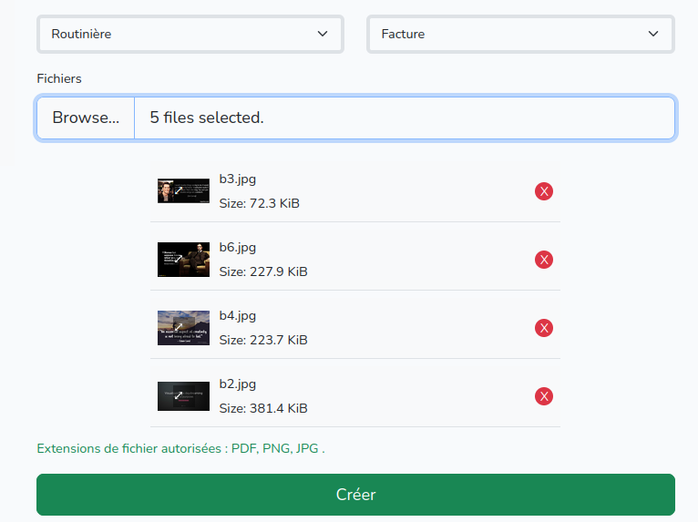

# مشروع إدارة المراسلات الإدارية

## الوصف
يهدف هذا المشروع إلى تسهيل إدارة المراسلات الإدارية داخل الشركة بطريقة بسيطة وفعالة. يعتمد النظام على إدارة المراسلات محليًا.
## الميزات

### 1. المدير
- **صلاحيات كاملة**: يمتلك المدير صلاحيات كاملة على النظام، مما يتيح له التحكم في جميع المراسلات والإعدادات.

### 2. المسير
- **إضافة المراسلات**: يمكن للمسير إضافة مراسلات جديدة بسهولة.
- **تعيين المصالح**: يقوم المسير بإسناد المراسلات إلى المصالح المعنية التي يحق لها الاطلاع عليها.

### 3. الموظف
- **الاطلاع على المراسلات**: يمكن للموظف الاطلاع على المراسلات المخصصة لمصلحته.
- **الموافقة أو الرفض**: يتيح النظام للموظف إمكانية الموافقة على المراسلات أو رفضها.

## صور عن المشروع

## المشاركة في التطوير 

نرحب بجميع المساهمين الجدد في مشروعنا! قبل البدء، نوصي بشدة بمراجعة قسم القضايا (issues) في مستودع المشروع. ستجد هناك قائمة بالتحديات والمهام الحالية التي تحتاج إلى المساعدة. من خلال الاطلاع على القسم المذكور ، يمكنك تحديد المجالات التي تتناسب مع مهاراتك واهتماماتك، والمساهمة بشكل فعال في تحسين المشروع.

### ملحوظة 

في حالة واجهتك مشكلة أثناء رفع ملفات PDF، يرجى اتباع الخطوات التالية:

في بيئة تطويرك المحلية ، قم بتعديل ملف php.ini وأضف : 

; Maximum allowed size for uploaded files.
upload_max_filesize = 10M 

; Must be greater than or equal to upload_max_filesize
post_max_size = 10M 

---

# Projet de Gestion des Correspondances Administratives

## Description
Ce projet vise à simplifier la gestion des correspondances administratives au sein de l'entreprise de manière simple et efficace. Le système permet de gérer les correspondances localement.

## Caractéristiques

### 1. Directeur
- **Plein accès** : Le directeur dispose d'un accès complet au système, lui permettant de contrôler toutes les correspondances et les paramètres.

### 2. Gestionnaire
- **Ajouter des correspondances** : Le gestionnaire peut facilement ajouter de nouvelles correspondances.
- **Affecter des services** : Le gestionnaire attribue les correspondances aux services concernés qui ont le droit de les consulter.

### 3. Employé
- **Consulter les correspondances** : L'employé peut consulter les correspondances qui lui sont destinées.
- **Approuver ou refuser** : Le système permet à l'employé d'approuver ou de refuser les correspondances.

## Participation au développement

Nous accueillons tous les nouveaux contributeurs dans notre projet ! Avant de commencer, nous vous recommandons vivement de consulter la section des problèmes (issues) dans le dépôt du projet. Vous y trouverez une liste des défis et des tâches actuelles qui nécessitent de l'aide. En consultant cette section, vous pourrez identifier les domaines qui correspondent à vos compétences et à vos intérêts, et contribuer efficacement à l'amélioration du projet.

### Remarque 

En cas de problème lors du téléchargement de fichiers pdf , veuillez procéder comme suit :

Dans votre environnement de développement local en php.ini  : 

; Maximum allowed size for uploaded files.
upload_max_filesize = 10M 

; Must be greater than or equal to upload_max_filesize
post_max_size = 10M 

